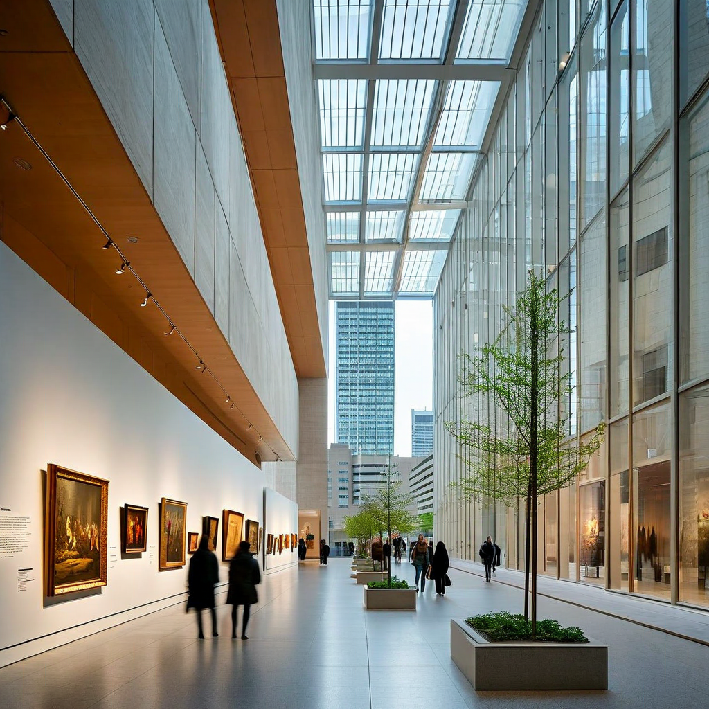
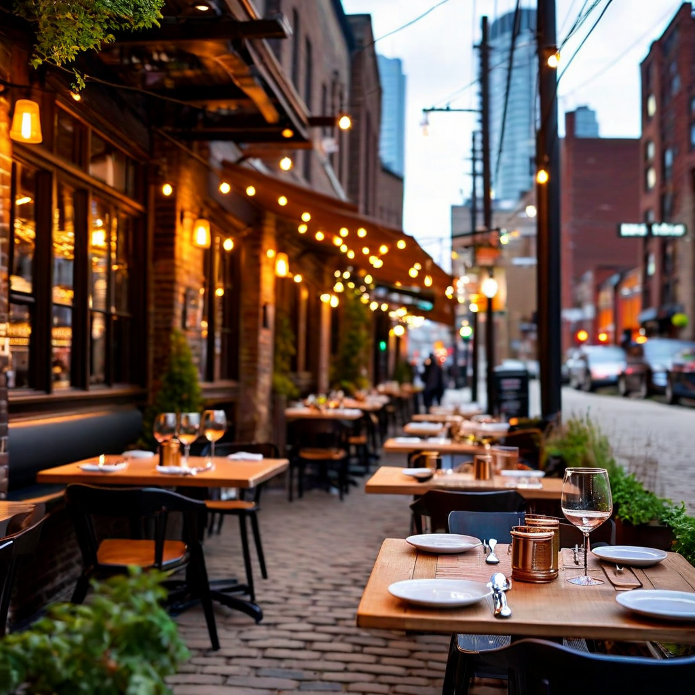

# AI City Navigator — Trip Output (Toronto)

## Trip Overview
- **Destination:** Toronto
- **Duration:** 4 days
- **Travel Month:** August
- **Travel Style:** balanced
- **Interests:** food, culture, photography

## City Summary
Toronto is the most populous city in Canada and the capital of Ontario. It is known for its cultural diversity, business, finance, arts, sports, and cosmopolitan atmosphere.

## Seasonal Context
August in Toronto is summer, with warm temperatures and a vibrant atmosphere. Many outdoor activities and festivals are available.

## Transport Notes
- Toronto has an extensive public transit system including buses, streetcars, and the subway.
- Consider using a PRESTO card for convenient transit payments.

## Budget Breakdown
- **Lodging:** 800
- **Food:** 600
- **Transport:** 200
- **Activities:** 500
- **Buffer:** 100

## Recommended Apps
| Name | Category | Why It Helps |
| --- | --- | --- |
| Transit | Navigation | Helps with navigating Toronto's public transit system. |
| OpenTable | Dining | Assists in finding and booking restaurants. |

## Itinerary

### Day 1 — Cultural Exploration
- **09:00–12:00** Art Gallery of Ontario (Art Gallery of Ontario, Downtown)
  - Type: Museum Visit | Cost: 25
  - Transit: Take the subway to Osgoode Station.
  - Why: Aligns with interest in culture and photography.
- **13:00–15:00** Distillery District (Distillery District, Downtown)
  - Type: Historic Site Visit | Cost: 0
  - Transit: Walk from Art Gallery of Ontario.
  - Why: Aligns with interest in culture and photography.
- **15:30–17:00** Dinner at Distillery District (Distillery District, Downtown)
  - Type: Dining | Cost: 50
  - Transit: Walk from Distillery District.
  - Why: Aligns with interest in food.
- **17:30–19:30** Evening at Distillery District (Distillery District, Downtown)
  - Type: Photography | Cost: 0
  - Transit: Walk from Distillery District.
  - Why: Aligns with interest in photography.

### Day 2 — Landmark and Museum Day
- **09:00–12:00** Royal Ontario Museum (Royal Ontario Museum, Midtown)
  - Type: Museum Visit | Cost: 25
  - Transit: Take the subway to Museum Station.
  - Why: Aligns with interest in culture.
- **12:30–13:30** Lunch at Royal Ontario Museum (Royal Ontario Museum, Midtown)
  - Type: Dining | Cost: 20
  - Transit: Walk from Royal Ontario Museum.
  - Why: Aligns with interest in food.
- **14:00–17:00** CN Tower (CN Tower, Downtown)
  - Type: Landmark Visit | Cost: 50
  - Transit: Take the subway to Union Station.
  - Why: Aligns with interest in culture and photography.

### Day 3 — Market and Park Day
- **12:00–14:00** Kensington Market (Kensington Market, Chinatown)
  - Type: Market Visit | Cost: 0
  - Transit: Take the subway to Spadina Station.
  - Why: Aligns with interest in food and culture.
- **14:30–15:30** Lunch at Kensington Market (Kensington Market, Chinatown)
  - Type: Dining | Cost: 25
  - Transit: Walk from Kensington Market.
  - Why: Aligns with interest in food.
- **16:00–18:00** High Park (High Park, West End)
  - Type: Park Visit | Cost: 0
  - Transit: Take the subway to High Park Station.
  - Why: Aligns with interest in nature and photography.

### Day 4 — Free Day
- **09:00–18:00** Explore Toronto (Various, Various)
  - Type: Free Time | Cost: 0
  - Transit: Use public transit as needed.
  - Why: Allows for spontaneous activities and exploration.

## Media Scenes

### Art Gallery of Ontario (High)
- Prompt: Photograph the diverse art collection displayed within the Art Gallery of Ontario, capturing the interplay of natural light with the architectural details of the building. Ensure the scene includes a variety of artworks, from modern to classical pieces, with a focus on the gallery's interior design and the ambiance created by the lighting.
- Image File: `bengaluru_4d_live_scene_1.png`

### Dinner at Distillery District (Medium)
- Prompt: Capture the intimate dining experience at a restaurant in Toronto's Distillery District. Focus on the presentation of the dishes, the cozy ambiance of the restaurant, and the charming street views outside. The photo should convey the warmth and character of the area, with a clear view of the historic buildings and cobblestone streets.
- Image File: `bengaluru_4d_live_scene_2.png`

### CN Tower (High)
- Prompt: Photograph the panoramic views of Toronto from the CN Tower. Use a wide-angle lens to capture the cityscape, including the skyline, the lake, and the distant horizon. The image should be taken during the golden hour, with soft, warm lighting that highlights the city's architecture and the serene waters of the lake.
- Image File: not generated in this run

### High Park (Medium)
- Prompt: Capture the natural beauty of Toronto's High Park, focusing on the scenic trails and the park's wildlife. Photograph the lush greenery, the winding paths, and the serene atmosphere. Include a view of the zoo within the park, showcasing the animals in their natural-like habitats. The photo should be taken during a sunny day, with ample natural light highlighting the park's features.
- Image File: not generated in this run

## Warnings
- Toronto can be busy during summer festivals; plan accordingly.
- Be mindful of weather changes; pack layers for variable temperatures.
