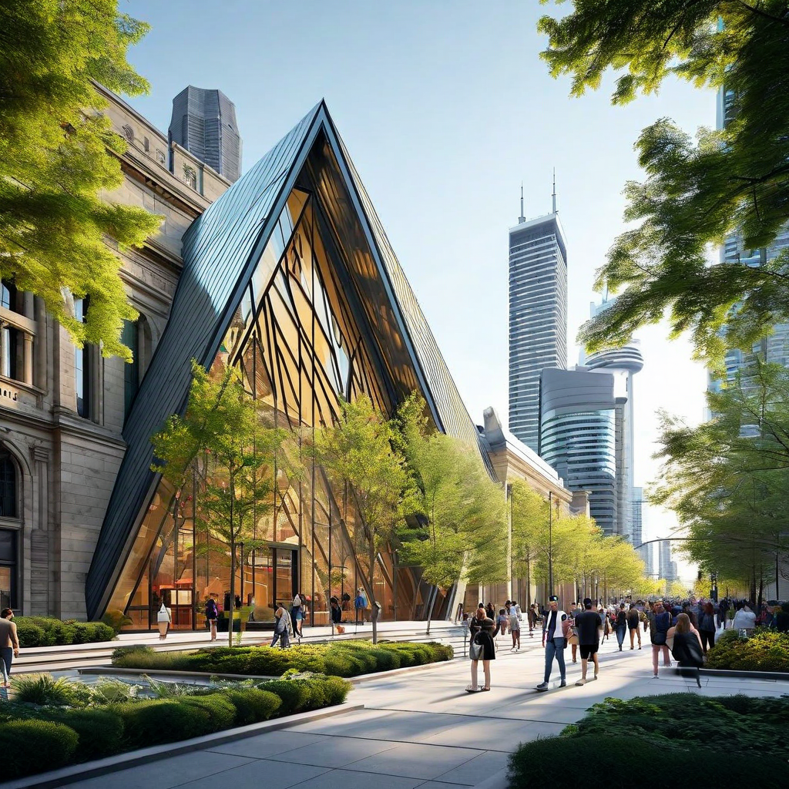
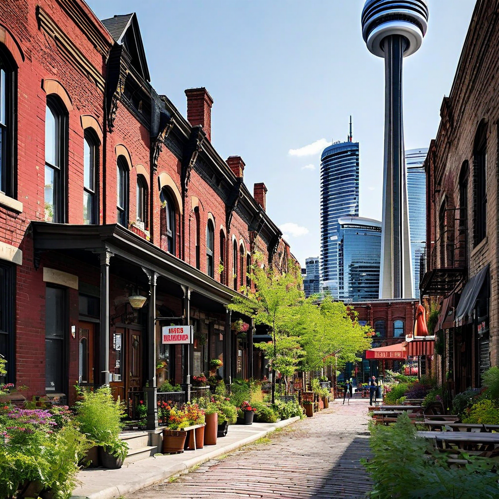
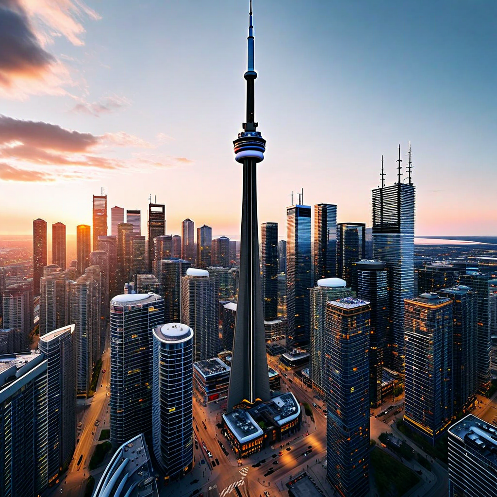
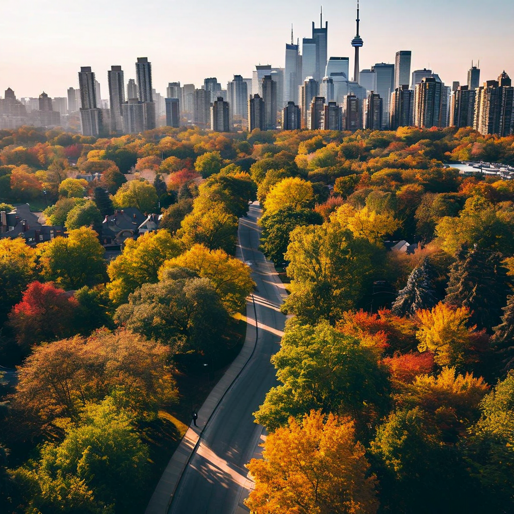

# AI City Navigator — Trip Output (Toronto)

## Trip Overview
- **Destination:** Toronto
- **Duration:** 4 days
- **Travel Month:** August
- **Travel Style:** balanced
- **Interests:** food, culture, photography

## City Summary
Toronto is the most populous city in Canada and the capital of Ontario. It is known for its cultural diversity, business, finance, arts, sports, and cosmopolitan atmosphere.

## Seasonal Context
In August, Toronto experiences warm summer weather with average temperatures ranging from 20°C to 28°C. It's an ideal time for outdoor activities and exploring the city's parks and waterfront.

## Transport Notes
- Toronto has an extensive public transit system including buses, streetcars, and the subway. Consider getting a Presto card for convenient travel.
- Walking and biking are popular ways to explore the city, especially in areas like the Distillery District and along the waterfront.

## Budget Breakdown
- **Lodging:** 700
- **Food:** 600
- **Transport:** 200
- **Activities:** 500
- **Buffer:** 200

## Recommended Apps
| Name | Category | Why It Helps |
| --- | --- | --- |
| TTC App | Transit | Provides real-time transit information for Toronto's public transportation system. |
| OpenTable | Dining | Helps you discover and book restaurants in Toronto. |
| TripIt | Travel Organization | Organizes your travel plans, including flights, hotels, and reservations. |

## Itinerary

### Day 1 — Cultural Exploration
- **09:00–13:00** Visit Royal Ontario Museum (Royal Ontario Museum, Midtown)
  - Type: Museum Visit | Cost: 25
  - Transit: Take the subway to Museum Station.
  - Why: Aligns with interest in culture and museum visits.
- **13:00–14:00** Lunch at Kensington Market (Kensington Market, Chinatown)
  - Type: Dining | Cost: 20
  - Transit: Take the streetcar to Spadina Ave.
  - Why: Aligns with interest in food and market exploration.
- **14:00–16:00** Explore Distillery District (Distillery District, Downtown)
  - Type: Walking Tour | Cost: 0
  - Transit: Walk from Kensington Market.
  - Why: Aligns with interest in historic sites and photography.
- **18:00–19:30** Dinner at Distillery District (Distillery District, Downtown)
  - Type: Dining | Cost: 30
  - Transit: Walk to a restaurant.
  - Why: Aligns with interest in food and culture.

### Day 2 — Landmark and Outdoor Activities
- **10:00–13:00** Visit CN Tower (CN Tower, Downtown)
  - Type: Observation Deck Visit | Cost: 35
  - Transit: Take the subway to Union Station.
  - Why: Aligns with interest in landmarks and photography.
- **13:00–14:00** Lunch at CN Tower (CN Tower, Downtown)
  - Type: Dining | Cost: 25
  - Transit: Walk to the 360 Restaurant.
  - Why: Aligns with interest in food.
- **14:00–16:00** Picnic at High Park (High Park, West End)
  - Type: Picnic | Cost: 10
  - Transit: Take the subway to High Park Station.
  - Why: Aligns with interest in parks and outdoor activities.
- **16:00–17:00** Explore High Park Zoo (High Park, West End)
  - Type: Zoo Visit | Cost: 5
  - Transit: Walk within the park.
  - Why: Aligns with interest in parks and photography.

### Day 3 — Market Exploration
- **10:00–12:00** Explore Kensington Market (Kensington Market, Chinatown)
  - Type: Market Visit | Cost: 0
  - Transit: Walk from previous location.
  - Why: Aligns with interest in markets and food.
- **12:00–13:00** Lunch at Kensington Market (Kensington Market, Chinatown)
  - Type: Dining | Cost: 20
  - Transit: Walk to a restaurant.
  - Why: Aligns with interest in food.
- **13:00–16:00** Visit Toronto Islands (Toronto Islands, Downtown)
  - Type: Beach and Park Visit | Cost: 10
  - Transit: Take the ferry from Jack Layton Ferry Terminal.
  - Why: Aligns with interest in parks and outdoor activities.
- **16:00–17:30** Dinner at Toronto Islands (Toronto Islands, Downtown)
  - Type: Dining | Cost: 30
  - Transit: Walk to a restaurant.
  - Why: Aligns with interest in food and photography.

### Day 4 — Relaxation and Leisure
- **10:00–12:00** Relax at High Park (High Park, West End)
  - Type: Picnic | Cost: 10
  - Transit: Take the subway to High Park Station.
  - Why: Aligns with interest in parks and relaxation.
- **12:00–13:00** Lunch at High Park (High Park, West End)
  - Type: Dining | Cost: 20
  - Transit: Walk to a restaurant.
  - Why: Aligns with interest in food.
- **14:00–16:00** Explore Distillery District (Distillery District, Downtown)
  - Type: Walking Tour | Cost: 0
  - Transit: Take the streetcar to Distillery Loop.
  - Why: Aligns with interest in historic sites and photography.
- **18:00–19:30** Dinner at Distillery District (Distillery District, Downtown)
  - Type: Dining | Cost: 30
  - Transit: Walk to a restaurant.
  - Why: Aligns with interest in food and culture.

## Media Scenes

### Royal Ontario Museum (High)
- Prompt: A photorealistic image capturing the diverse collections and exhibits within the Royal Ontario Museum. The scene should be bathed in natural light, highlighting the intricate details of the artifacts and displays. The time of day should be early afternoon to ensure ample daylight, and the crowd level should be moderate to avoid any distractions.
- Image File: `toronto_4d_live_all_scene_1.png`

### Distillery District (High)
- Prompt: A photorealistic image capturing the Victorian architecture and cobblestone streets of the Distillery District. The photo should be taken with a wide-angle lens to encompass the historic charm of the area. The weather should be clear and sunny, with the season being late spring or early summer to showcase the vibrant greenery. The crowd level should be moderate, with a few visitors exploring the area.
- Image File: `toronto_4d_live_all_scene_2.png`

### CN Tower (High)
- Prompt: A photorealistic image capturing the panoramic views from the observation deck of the CN Tower. The photo should be taken using a tripod to ensure stability and sharpness, focusing on the expansive cityscape below. The time of day should be late afternoon to capture the golden hour, with the weather being clear and the crowd level being moderate.
- Image File: `toronto_4d_live_all_scene_3.png`

### High Park (Medium)
- Prompt: A photorealistic image capturing the greenery and trails of High Park. The photo should be taken using a drone to provide an aerial view of the park's natural beauty. The season should be early autumn, with the weather being mild and clear. The crowd level should be low to highlight the serene environment.
- Image File: `toronto_4d_live_all_scene_4.png`

## Warnings
- Toronto can be busy during the summer months, especially in popular tourist areas. Plan accordingly to avoid crowds.
- Be mindful of your belongings in crowded areas and use public transportation safely.
